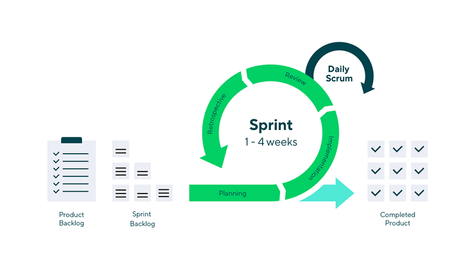

# Scrum-ohje projektille
Tähän tulee tekstiä.
Tehdään työt hyvin ja ajallaan

## Mikä on Scrum?
### Scrum-menetelmä
- Scrum on yleisimmin käytössä oleva ketterä (agile) ohjelmistoprojektimalli, mutta ei ainoa.
- Scrum-projekti etenee määrämittaisissa sprinteissä. Sprintin kesto on tavallisesti 2-4 viikkoa.
- Scrum (kuten kaikki ketterät menetelmät) on siis iteratiivinen ja inkrementaalinen:
lopputulos muodostuu toistuvissa ajallisesti lyhyissä kehityssykleissä syntyneiden pienten
lisäysten kautta.

## Scrum-syklin (sprint) yleiskuvaus
- Ennen sprintin aloittamista, tiimi kokoontuu sprintin suunnittelukokoukseen. Tässä kokouksessa määritellään sprintin sisältö sekä tavoitteet. Tavoitteet asetetaan liiketoiminnan vaatimusten mukaiseen järjestykseen tuotejonoksi. Tuotejono on priorisoitu luettelo ominaisuuksista, jotka on tarkoitus toteuttaa projektin aikana. Kokouksessa keskustellaan myös parhaista menetelmistä ja tavoista, joilla tiimi voi suorittaa tehtävät tehokkaasti ja laadukkaasti.
- Sprintin aikana tiimi työskentelee päivittäin jaksoissa, joissa keskitytään sprintin tuotejonon tehtävien toteuttamiseen. Päivittäin pidetään Scrum-kokous, jossa tiimi keskustelee edistymisestään, esteistä ja seuraavista vaiheista.
- Sprintin lopussa pidetään loppukatselmointi. Tässä kokouksessa tiimi esittelee työnsä tulokset ja tarkistaa saavutetun tason toimivuuden ja mahdollisen tuotantokelpoisuuden. Lisäksi arvioidaan, tarvitaanko vielä lisää sprinttejä tavoitteiden saavuttamiseksi. 
- Tarvittaessa suunnitellaan uuden sprintin tuotejono sekä tavoitteet ja aloitetaan uusi sprintti. Tämä prosessi toistuu, kunnes kaikki tuotejonon tehtävät on suoritettu ja varsinainen lopputuote on valmis.

## Sprintit
- Työ jaksotetaan määrämittaisiksi, lyhyiksi iteraatioiksi, joita Scrum-menetelmässä
kutsutaan sprinteiksi.
- Sprinttiin otetaan tavoitteeksi tuotteen työjonosta päällimmäisiä (eli tärkeimpiä)
asioita. Ne pyritään tekemään sprintissä niin valmiiksi, että ne voitaisiin julkaista.
- Sprintin tavoite on siis määriteltävä niin pieneksi, että se voidaan tehdä yhdessä
iteraatiossa valmiiksi. Jos aika uhkaa loppua kesken, sprinttiä ei pidennetä vaan
tekemättä jäänyt työ työ siirtyy seuraaville sprinteille.

## Työjonot
- Työjono on olennainen osa Scrum-menetelmää. Työjonon avulla organisoimme tehtäviä, jotta ryhmä voi keskittyä tehokkaaseen työskentelyyn.
### Periaatteet
- Työjonolla organisoidaan ja priorisoidaan tehtäviä.
- Sprintin alussa ryhmä valitsee tehtäviä työjonoon tehtävien tärkeyden perusteella.
- Työjonon visualisointiin voidaan käyttää erilaisia työkaluja, kuten Kanban-taulua.
- Ryhmä päättää työjonon visualisointiin käytettävän työkalun yhdessä.
- Työjonoa päivitetään jatkuvasti projektin edetessä.
- Tärkeimmät tehtävät pidetään työjonon kärjessä.
- Työjonosta valitaan tehtäviä, jotka ovat saavutettavia sprintin aikana.

## Roolit
Tähän tulee tekstiä.

## Kokoukset
- Kokouspäivä päätetään yhdessä.
- Jos ryhmän jäsen ei pysty osallistumaan kokoukseen hänen täytyy ilmoittaa asiasta ryhmälle. 
- Kokoukset pyritään sopimaan ajankohdalle, jolloin kaikki tai mahdollisimman moni pääsee osallistumaan.
- Ryhmän kokoukset järjestetään pääsääntöisesti ryhmän omalla Teams-kanavalla.
- Kokouksissa käydään läpi muutoksia, joita on tapahtunut edellisen kokouksen jälkeen.
- Ryhmän jäsenet päättävät projektin seuraavat askeleet yhdessä kokouksissa. 
- Sprintin päätyttyä käydään ryhmän kanssa läpi sprintin tulokset ja aletaan suunnittelemaan seuraavaa sprinttiä.

## Miksi Scrum toimii?
- Scrum-menetelmä on joustava, mahdollistaen tehtävien helpon priorisoinnin. Se nopeuttaa tuotantoa tarjoten tehokkaan tavan tuottaa käyttövamiin lopputuotteen. Menetelmässä tiimi toimii itseohjautuvasti ja ketterästi, keskittyen lopputuotteen laatuun. Menetelmä korostaa myös yhteistyön merkitystä ja pyrkii parantamaan työntekijöiden tyytyväisyyttä, mikä tekee siitä erinomaisen valinnan etenkin pieniin ja keskisuuriin projekteihin.

## Lähteet
- Scrum Guides. (2020). Scrum Guide. Luettavissa: https://scrumguides.org/docs/scrumguide/v1/Scrum-Guide-FI.pdf. Viitattu: 26.01.2024.