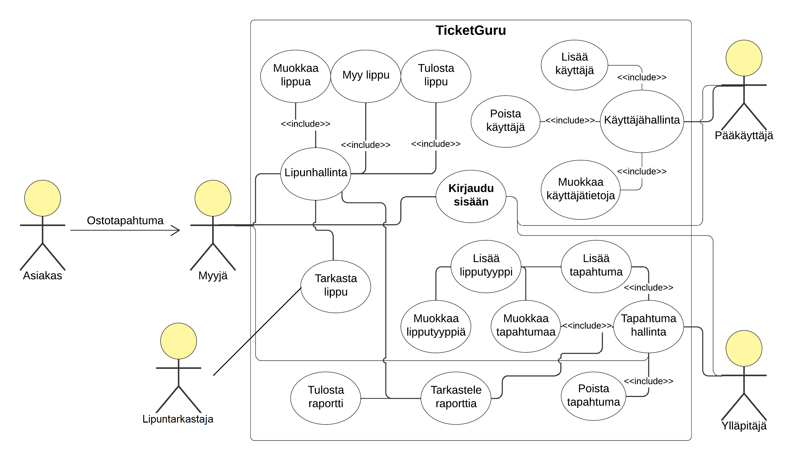

# TicketGuru by Kaaos Solutions
Tiimi: Ilja Haapanen, Leonid Petrov, Sampsa Loukkola, Santeri Kuronen.

## Johdanto
Projektin tarkoituksena on tuottaa lipunmyyntijärjestelmä. Asiakkaana on lipputoimisto, joka on tilannut lipunmyyntijärjestelmän lippujen myymiseen myyntipisteessään. Alustava nimi järjestelmälle on TicketGuru.

Lipputoimisto määrittelee TicketGurussa tapahtumat, joihin lippuja myydään. Sovelluksella hallinnoidaan sekä seurataan lipunmyyntiä. Lipunmyyjät ja toimiston henkilökunta käyttävät sovellusta, asiakkaat eivät voi ostaa lippuja suoraan järjestelmästä omatoimisesti vaan myynti tapahtuu ennakkoon myyjän kautta tai tapahtuman ovelta. Tapahtumia voi lisätä, muokata ja niihin voi luoda erilaisia lipputyyppejä. Lippuja pitää voida myydä ja tulostaa ja lippujen on sisällettävä helposti tarkastettava yksilöivä koodi, jotta lippu voidaan varmentaa aidoksi sekä merkitä käytetyksi. Ennakkomyynnin jälkeen jäljellä olevat liput tulee pystyä tulostamaan, jotta ne voidaan myydä tapahtuman ovella.

Myytyjen lippujen määrää voidaan seurata raporteilta tapahtumakohtaisesti. Järjestelmä on tarkoitettu käytettäväksi selaimen kautta päätteellä, ja sen on tarkoitus olla täysin responsiivinen ja selainriippumaton.

Asiakas haluaa jatkokehittää ja laajentaa palveluitaan myös verkkokaupan suuntaan, mutta jatkokehitys ei ole osa tätä projektia.

## Järjestelmän määrittely
Lipunmyyntijärjestelmä on määritelty alla erikseen käyttäjäryhminä, käyttäjätarinoina sekä käyttötapauskaaviona.

### Käyttäjäryhmät
**Tilaaja**
- Lipputoimisto, joka on tilannut lipunmyyntijärjestelmän

**Pääkäyttäjä**
- Pääkäyttäjä voi lisätä, muokata sekä poistaa käyttäjäoikeuksia

**Ylläpitäjä**
- Ylläpitäjä syöttää järjestelmään tapahtumia

**Myyjä**
- Myyjä lisää järjestelmään tilauksia ja tarkastaa lippuja

**Asiakas**
- Asiakas ostaa lipun tiettyyn tapahtumaan

### Käyttäjätarinat
Käyttäjätarinat löytyvät projektin SCRUM-taulun vasemmasta laidasta. [Linkki tauluun](https://github.com/users/Santks/projects/3/views/1).

### Käyttötapauskaavio

## Käyttöliittymä
Alustava tekstimuotoinen mallikuvaus käyttöliittymästä rautalankamallin perusteella.

| Näkymä | Kuvaus |
|--------|--------|
| Lipunmyynti | Listaus tapahtumista, joihin lippuja myydään. Tapahtumista tiedot (nimi, päivämäärä, kellonaika). Valitusta tapahtumasta tulee näkyville myös lippujen kategoriat ja hinnat. Ostettavien lippujen määrää voi vaihtaa. Lippujen kokonaissumma näytetään myyntitapahtumaan johtavan painikkeen läheisyydessä. |
| Myyntitapahtuma | Ostetuista lipuista näytetään yhteenveto, josta tulee ilmi myyntitapahtuman yksilöivä tunnus, maksupäivämäärä ja kellonaika, sekä maksettu summa. Lisäksi taulukko ostetuista tuotteista kategorisoituna (tapahtuma, lipputyyppi, hinta, yksilöivä tunnus). Näkymässä on myös painike lippujen tulostusta varten. |
| Tapahtumien hallinta (listaus) | Ylläpidon näkymä listauksena tapahtumista ja niiden tiedoista. Jokaisen tapahtuman yhteydessä painikkeet, joista siirtymä eri näkymiin: (muokkaus, lipputyypit, myyntiraportti). Näkymässä on myös painike uuden tapahtuman luontia varten. |
| Tapahtumien hallinta (muokkaus) | Näkymä, jossa kaikkia tapahtuman tietoja voi muokata poislukien lipputyypit. Näkymässä myös tallennus-painike. |
| Tapahtumien hallinta (uusi) | Näkymä yhtenäinen "Tapahtumien hallinta (muokkaus)" kanssa. |
| Tapahtumien hallinta (lipputyypit) | Yhden tapahtuman lipputyypit ja niiden tiedot listaava näkymä. Jokaisen listatun lipputyypin yhteydessä painike tietojen muokkausta varten. Uuden lipputyypin lisäystä varten lomake-tyyppinen ratkaisu. |
| Myyntiraportti | Yhden tapahtuman yhteenveto, josta selviää tapahtumaan myytyjen lippujen tyypit ja kappalemäärät. Painike, josta siirtymä näkymään "Tapahtuma (myyntitapahtumat)". |
| Tapahtuma (myyntitapahtumat) | Näkymä, jossa listaus kaikista yhden tapahtuman myyntitapahtumista. Kategorisoitu (aika, yksilöivä tunnus, kokonaissumma, toiminnot). Toiminnot-sarakkeessa painike näkymään, jossa tarkemmat tiedot yhdestä myyntitapahtumasta. |

### Käyttöliittymäkaavio
Kirjautumisen yhdeydessä tarkistetaan käyttäjän oikeudet ja sen mukaan määräytyy, mitä etusivulla näytetään. Esimerkiksi vain pääkäyttäjä pääsee muokkaamaan käyttäjiä ja käyttäjäoikeuksia, kun taas myyjällä on oikeudet vain lippujen myymiseen ja lipuntarkastajalla on vain mahdollisuus tarkastaa lipun voimassaolo.

## Tietokanta
Järjestelmään säilöttävät ja siinä käsiteltävät tiedot ja niiden väliset suhteet on kuvattu alla UML-kaaviona sekä tietohakemistona.

### UML-kaavio
** Kuva tähän **

### TG_1
1 -taulu sisältää tapahtumapaikkojen tiedot lorem ipsum testing ipsum lorem.
**tähän atribuutit taulukkona**

### TG_2
1 -taulu sisältää tapahtumapaikkojen tiedot lorem ipsum testing ipsum lorem.
**tähän atribuutit taulukkona**

### TG_3
1 -taulu sisältää tapahtumapaikkojen tiedot lorem ipsum testing ipsum lorem.
**tähän atribuutit taulukkona**

### TG_4
1 -taulu sisältää tapahtumapaikkojen tiedot lorem ipsum testing ipsum lorem.
**tähän atribuutit taulukkona**

### TG_5
1 -taulu sisältää tapahtumapaikkojen tiedot lorem ipsum testing ipsum lorem.
**tähän atribuutit taulukkona**

## Tekninen kuvaus
Teknisessä kuvauksessa esitetään järjestelmän toteutuksen suunnittelussa tehdyt tekniset ratkaisut, esim.

- Missä mikäkin järjestelmän komponentti ajetaan (tietokone, palvelinohjelma) ja komponenttien väliset yhteydet ([esimerkki](https://security.ufl.edu/it-workers/risk-assessment/creating-an-information-systemdata-flow-diagram/))
- Palvelintoteutuksen yleiskuvaus: teknologiat, deployment-ratkaisut yms.
- Keskeisten rajapintojen kuvaukset, esimerkit REST-rajapinta. Tarvittaessa voidaan rajapinnan käyttöä täsmentää UML-sekvenssikaavioilla.
- Toteutuksen yleisiä ratkaisuja, esim. turvallisuus.

### Tämän lisäksi
- ohjelmakoodin tulee olla kommentoitua
- luokkien, metodien ja muuttujien tulee olla kuvaavasti nimettyjä ja noudattaa johdonmukaisia nimeämiskäytäntöjä
- ohjelmiston pitää olla organisoitu komponentteihin niin, että turhalta toistolta vältytään

## Testaus
Tässä kohdin selvitetään, miten ohjelmiston oikea toiminta varmistetaan testaamalla projektin aikana: millaisia testauksia tehdään ja missä vaiheessa. Testauksen tarkemmat sisällöt ja testisuoritusten tulosten raportit kirjataan erillisiin dokumentteihin.

Tänne kirjataan myös lopuksi järjestelmän tunnetut ongelmat, joita ei ole korjattu.

## Asennustiedot
Järjestelmän asennus on syytä dokumentoida kahdesta näkökulmasta:

- Järjestelmän kehitysympäristö: miten järjestelmän kehitysympäristön saisi rakennettua johonkin toiseen koneeseen
- Järjestelmän asentaminen tuotantoympäristöön: miten järjestelmän saisi asennettua johonkin uuteen ympäristöön.

Asennusohjeesta tulisi ainakin käydä ilmi, miten käytettävä tietokanta ja käyttäjät tulee ohjelmistoa asentaessa määritellä (käytettävä tietokanta, käyttäjätunnus, salasana, tietokannan luonti yms.).

## Käynnistys- ja käyttöohje
Tyypillisesti tässä riittää kertoa ohjelman käynnistykseen tarvittava URL sekä mahdolliset kirjautumiseen tarvittavat tunnukset. Jos järjestelmän käynnistämiseen tai käyttöön liittyy joitain muita toimenpiteitä tai toimintajärjestykseen liittyviä asioita, nekin kerrotaan tässä yhteydessä.

Usko tai älä, tulet tarvitsemaan tätä itsekin, kun tauon jälkeen palaat järjestelmän pariin!